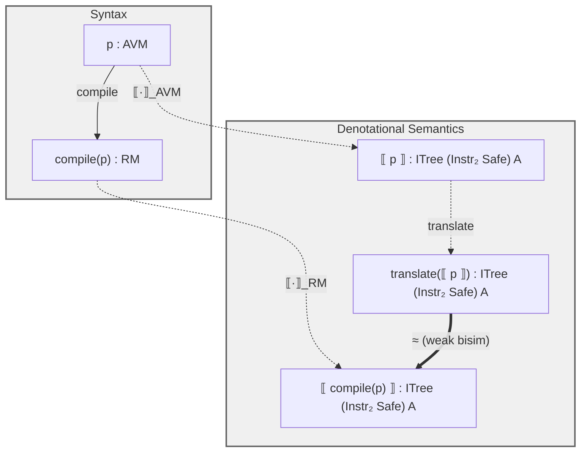
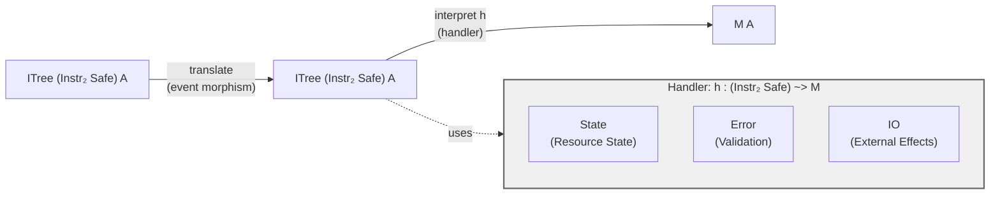

# Appendix: Semantics and Event Architecture

## Semantics

Both AVM and resource machine programs denote interaction trees. Compiler
correctness uses weak bisimulation to relate these denotations.

**Compiler Correctness.** For any AVM program p, compilation preserves
semantics: translate( p ) ≈  compile(p) .

The `translate` function maps AVM events (E_AVM) to resource machine events
(E_RM), preserving computational structure.

## Event Interpretation Architecture

Interaction trees interpret via event translation and handlers:

Event translation maps AVM operations to resource machine primitives. The
handler interprets primitives as concrete effects: state management, error
handling, and IO.
