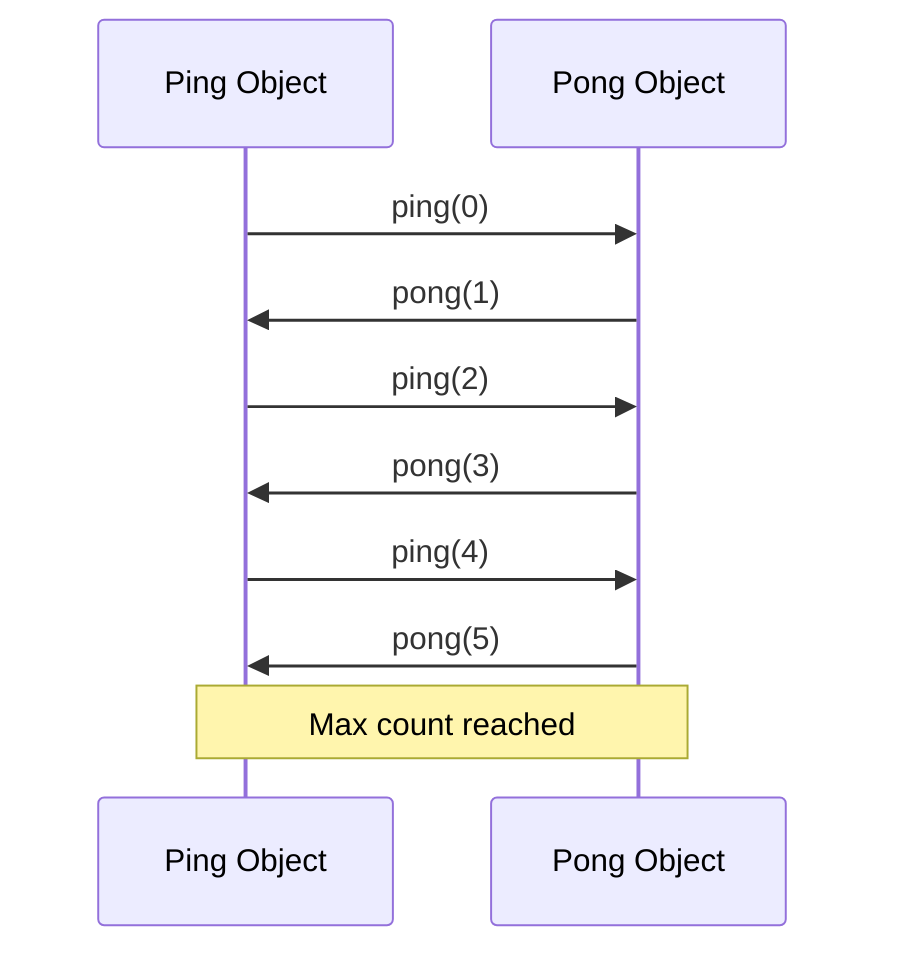

<div class="admonition quote collapse" markdown="1">
<p class="admonition-title">Quote</p>

```agda
{-# OPTIONS --without-K --type-in-type --guardedness #-}
module examples.PingPong.Main where
```

```agda

open import Background.BasicTypes
open import Background.InteractionTrees
```

</div>

This module presents a formal implementation of the Ping-Pong communication protocol utilizing the AVM object model, wherein object behaviors are encapsulated as executable AVM programs within object instances.

<figure markdown>



<figcaption>Communication protocol sequence between Ping and Pong objects, demonstrating asynchronous message passing until the maximum iteration count is reached.</figcaption>

</figure>

## Type System Definitions

First, we define the basic identifier types needed for the AVM:

```agda
NodeId : Set
NodeId = String

ObjectId : Set
ObjectId = NodeId × String
```

```agda
data MessageType : Set where
  Ping : MessageType
  Pong : MessageType
```

Protocol messages encapsulate the message type classification, iteration counter, partner object identifier, and maximum iteration bound, providing complete state for protocol execution.

```agda
record PingPongMsg : Set where
  constructor mkMsg
  field
    msgType : MessageType  -- either Ping or Pong
    counter : ℕ
    partnerId : ObjectId  -- who the message is for
    maxCount : ℕ

open PingPongMsg
```

The value type system is specialized to support the Ping-Pong protocol requirements, with a dedicated constructor for PingPong messages:

```agda
data Val : Set where
  VInt : ℕ → Val
  VString : String → Val
  VList : List Val → Val
  VPingPongMsg : PingPongMsg → Val
```

```agda
ControllerId : Set
ControllerId = String

MachineId : Set
MachineId = String

TxId : Set
TxId = ℕ
```

```agda
Input : Set
Input = Val

Output : Set
Output = Val

Message : Set
Message = Val
```

## Object Model Architecture

We define `ObjectBehaviour` as the type for object behaviors, which will be instantiated concretely in the Runner module:

```agda
ObjectBehaviour : Set
ObjectBehaviour = ⊤
```

With the ObjectBehaviour type established, we can import the AVM instruction set architecture parameterized by our type definitions:

```agda
open import AVM.Instruction Val ObjectId MachineId ControllerId TxId ObjectBehaviour
  hiding (Input; Output; InputSequence; Message)
```


## Executable Program Specifications

```agda
createPing : AVMProgram ObjectId
createPing = trigger (obj-create "ping")
```

```agda
createPong : AVMProgram ObjectId
createPong = trigger (obj-create "pong")
```

```agda
startPingPong : ℕ → AVMProgram Val
startPingPong maxCount =
  createPing >>= λ pingId →
  createPong >>= λ pongId →
  let initialMsg = VPingPongMsg record
        { msgType = Ping
        ; counter = 0
        ; partnerId = pongId
        ; maxCount = maxCount
        }
  in trigger (obj-call pingId initialMsg) >>= λ mResult →
     caseMaybe mResult
      -- valid result: complete
       (λ result → ret (VList (VString "complete" ∷ result ∷ [])))
       -- invalid result: call-failed
       (ret (VString "call-failed"))
```

```agda
pingPongExample : AVMProgram Val
pingPongExample = startPingPong 5
```

## Execution

See [Runner](./Runner.lagda.md) for the runner that uses
[AVM.Interpreter](../../AVM/Interpreter.lagda.md) to execute this example.
